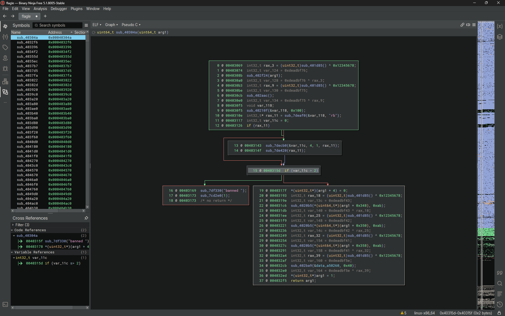
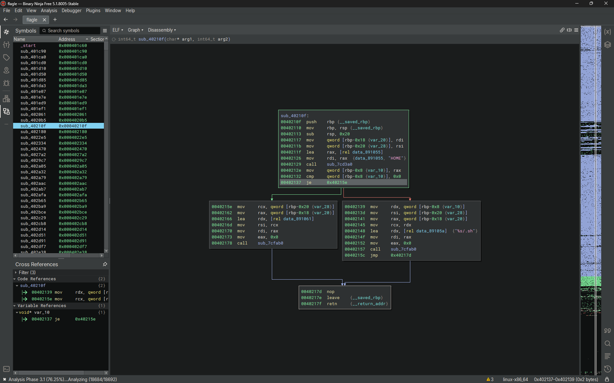

# Proof of Concept

---

TL;DR - Dynamic, Fuzzing, Bruteforce

# Writeup

---

The binary is nice enough not to punish guesses that aren't the same length as expected so bruteforcing the length is the way.

After determining the length, due to the nature of the challenge, we just need to exhaust all possible characters. However, this binary do have some anti-bruteforcing measures. Notably, the binary keeps track of failed attempts, in the form of a file in home named `~/.sh`.

Second screenshot shows a function that interracts with the `~/.sh`. And in the first screenshot, we see that the condition for getting banned is having the count be 3++ (above 2)

~~Knowing this, We can make 2 script. 1 that iterates through all of the possible characters and noting down any instances of 🟩 and deleting `~/.sh` every few iterations or so, and 1 that reconstruct the flag using the output of the previous script (this can obviously be combined into 1)~~

Knowing this we can make a script that iterates through all of the possible and noting down any instances of 🟩 and deleting `~/.sh` every few iterations or so, and reconstruct the flag. To speed things up, you can just patch the part where the program does a few junk calculations.